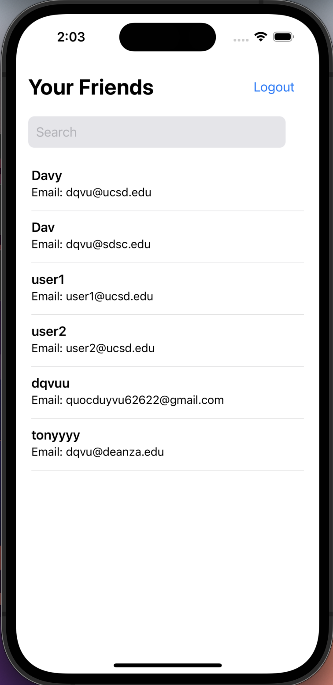
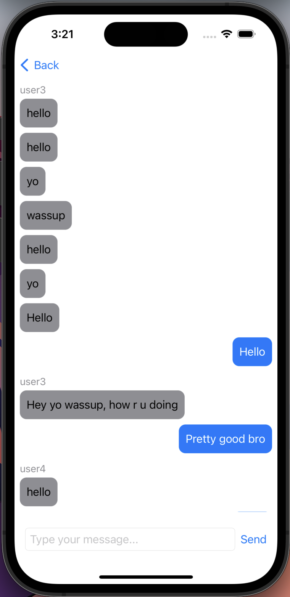

# ChatAppIOS
The Chat App is a messaging application that allows users to connect with others and start chatting. 

  |  

## Features
- User Registration: New users can sign up and create an account to join the Chat App community.
- User Search: Users can search for other users and view their profiles.
- Real-time Messaging: messaging functionality for real-time communication.

## Tech Stack

The Chat App is built using the following technologies:

- Frontend: SwiftUI
  - SwiftUI is used to create the user interface, providing a responsive app design.

- Backend: Node.js with Express
  - Node.js with Express is used to develop the server-side logic and handle API requests.

- Database: PostgreSQL
  - PostgreSQL is used as the database management system to store user data and messages.

## Installation

To run the Chat App locally on your machine, follow these steps:

1. Clone the repository: `git clone https://github.com/your-username/chat-app.git`
2. Navigate to the project directory: `cd server`
3. Install dependencies: `npm install`
4. Set up the PostgreSQL database and configure the connection settings.
5. Start the development server: `npm run start`
6. Open the ChatApp.xcodeproj in xcode and run build.

## How to Use

1. Register as a new user or log in using your existing credentials.
2. Explore the app, search for other users.
3. Start a conversation with another user by clicking on their profile.
